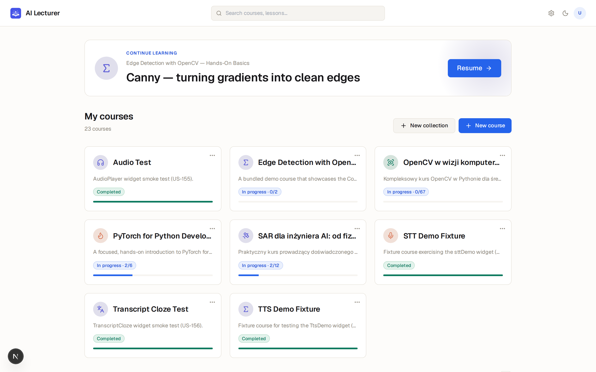
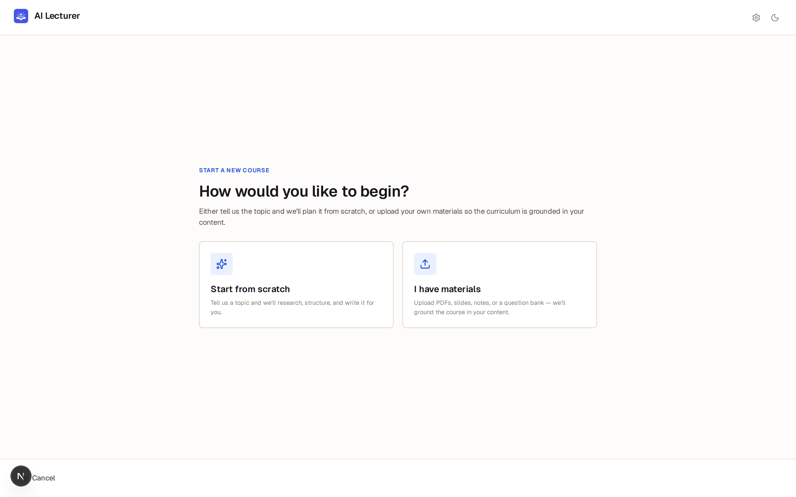
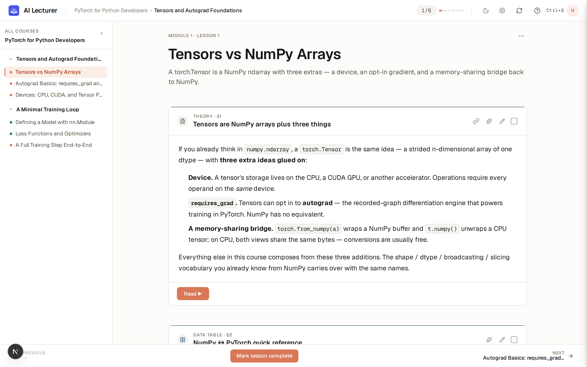
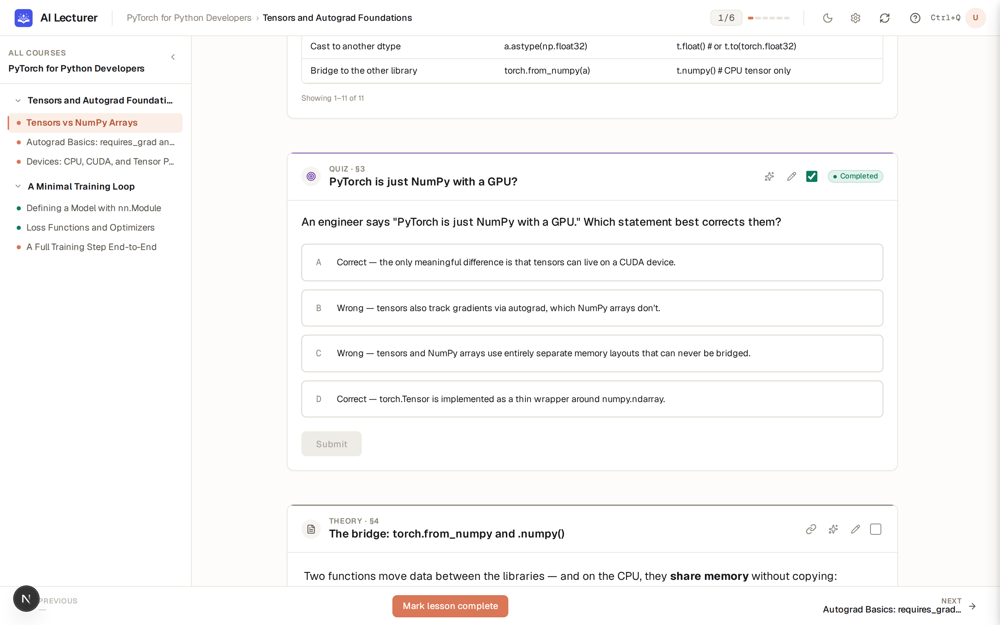
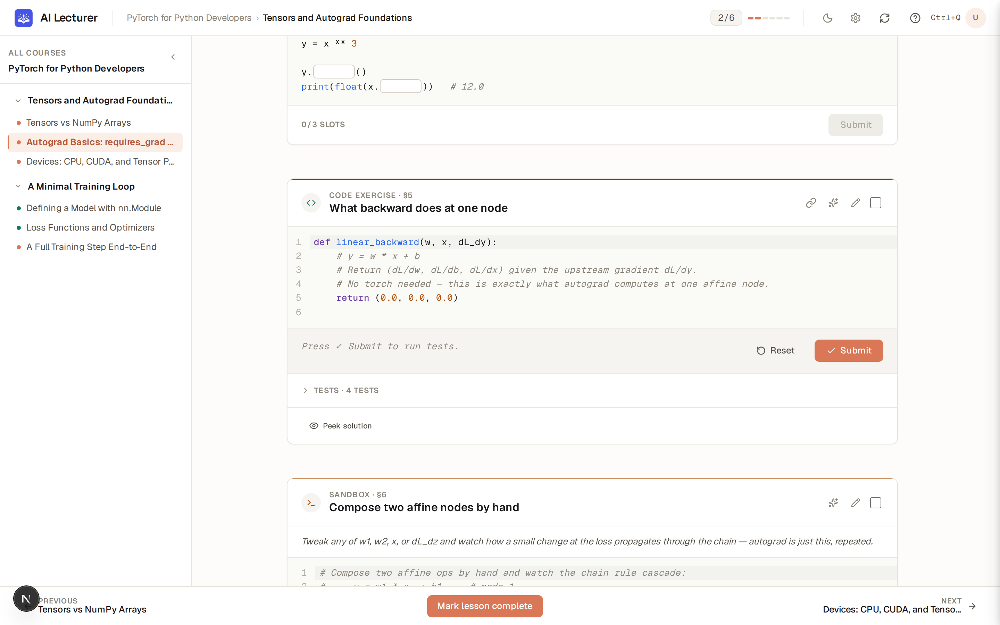
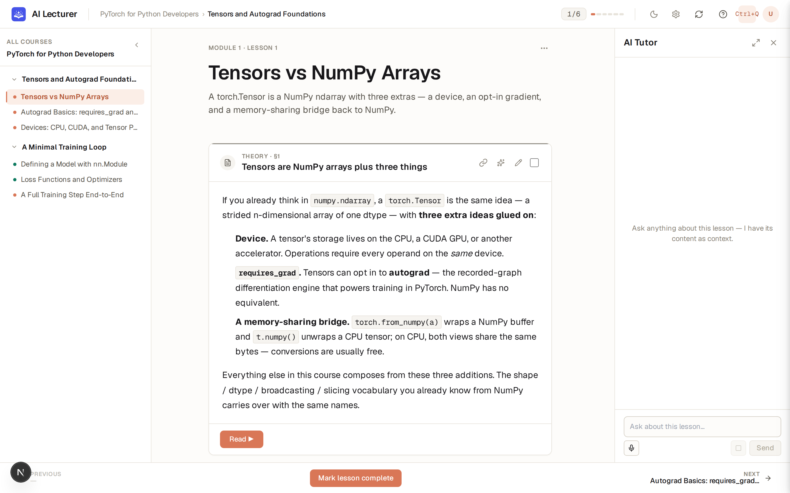
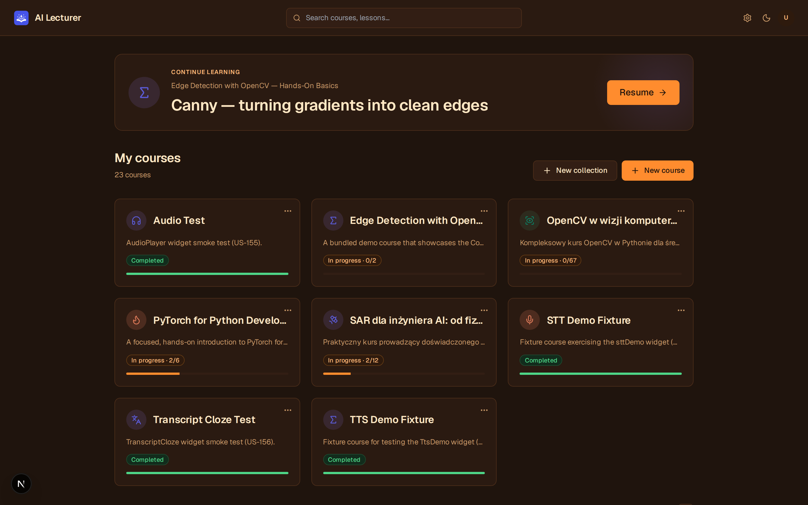
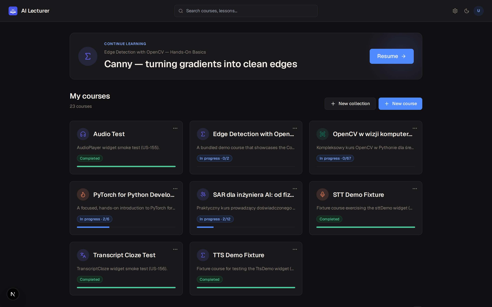

<p align="center">
  
</p>

<h1 align="center">AI Lecturer</h1>

<p align="center">
  <strong>Turn anything you want to learn into an interactive course — generated by AI, rendered in your browser, owned on your disk.</strong>
</p>

<p align="center">
  <sub>
    Built end-to-end with my own agent-loop orchestrator —
    <a href="https://github.com/NukeeMann/ralph_framework"><b>Ralph Framework</b></a>.
    Every widget, API route, and test in this repo was authored by Claude under Ralph's PRD-driven loop.
  </sub>
</p>

---

AI Lecturer is a single-user, locally-hosted study environment that produces Distill / 3blue1brown / Khan-Academy-style lessons on demand. Describe a topic (optionally with your own PDFs / DOCX as source material), answer a few clarifying questions, and the app drives your local `claude` CLI to research and write a multi-module course you can step through immediately — complete with quizzes, runnable Python, draggable matchings, parametric explorers, plots, and an in-lesson AI tutor that sees what you're looking at.

Everything is local. Courses are plain JSON on disk, progress lives in `~/.ai-lecturer/`, and the only "cloud" call is your own `claude` login. No database, no Anthropic API key in this repo, no telemetry.

---

<details open>
<summary><b>Screenshots</b></summary>

<br/>

<table>
  <tr>
    <td width="50%" valign="top">
      <a href="docs/screenshots/01-course-list.png"></a>
      <p align="center"><sub>Course library — resume card + grid of generated courses with per-course progress.</sub></p>
    </td>
    <td width="50%" valign="top">
      <a href="docs/screenshots/04-create-wizard.png"></a>
      <p align="center"><sub>Create-course wizard — start from a topic, or upload your own materials.</sub></p>
    </td>
  </tr>
  <tr>
    <td width="50%" valign="top">
      <a href="docs/screenshots/05-theory-widget.png"></a>
      <p align="center"><sub>Theory widget — Markdown + KaTeX with the lesson TOC sidebar.</sub></p>
    </td>
    <td width="50%" valign="top">
      <a href="docs/screenshots/06-quiz-widget.png"></a>
      <p align="center"><sub>Quiz widget — multiple-choice questions with per-answer feedback.</sub></p>
    </td>
  </tr>
  <tr>
    <td width="50%" valign="top">
      <a href="docs/screenshots/07-code-widget.png"></a>
      <p align="center"><sub>Code widget — Pyodide-backed Python editor with hidden tests + peek-solution.</sub></p>
    </td>
    <td width="50%" valign="top">
      <a href="docs/screenshots/08-lesson-chat.png"></a>
      <p align="center"><sub>LessonChat — the AI tutor dock that sees the lesson + focused widget.</sub></p>
    </td>
  </tr>
  <tr>
    <td width="50%" valign="top">
      <a href="docs/screenshots/02-sunset-theme.png"></a>
      <p align="center"><sub>Sunset theme — warm cream-on-charcoal palette (added in US-188).</sub></p>
    </td>
    <td width="50%" valign="top">
      <a href="docs/screenshots/03-dark-theme.png"></a>
      <p align="center"><sub>Dark theme — neutral slate with indigo accents.</sub></p>
    </td>
  </tr>
</table>

</details>

<details>
<summary><b>Why this exists</b></summary>

<br/>

Most online courses are static text + video. Most LLM "tutors" are a chat box that forgets the page you're on. AI Lecturer is neither:

- **Lessons are artifacts, not chats.** A course is a versioned tree of JSON. It re-opens identically tomorrow, diffs cleanly in git, and exports to a self-contained static site you can host anywhere.
- **Widgets, not paragraphs.** A lesson is a stream of typed widgets — `theory`, `quiz`, `code`, `codeCloze`, `demo`, `sandbox`, `histogram`, `plotImage`, `parametricExplorer`, `dragMatch`, `dataTable`, `video`, `audioPlayer`, `transcriptCloze`. Python widgets run in-browser via Pyodide; nothing leaves the page.
- **You drive scope.** The `/create` wizard asks *you* about depth, prerequisites, theory-vs-practice ratio, and target duration before it writes anything. You can extend a finished course with new lessons, regenerate any single lesson or section in place, and chat with a tutor that's aware of the exact widget you're stuck on.
- **Bring your own material.** Drop in PDFs, DOCX, or pasted notes; the wizard ingests them into the course outline so the generated content actually reflects your syllabus, not the model's priors.

</details>

<details>
<summary><b>Who it's for</b></summary>

<br/>

- **Self-learners** who want hands-on courses on niche topics (computer vision, SAR, PyTorch internals, a specific textbook chapter) without trawling YouTube.
- **Students** preparing for exams — feed in lecture slides + past papers, get a structured course with quizzes and code drills built around them.
- **Engineers ramping on a new domain** — generate a tailored crash course from internal docs and skim the parts you already know.
- **Tinkerers** who want a notebook-style learning surface they can extend with custom widget types (the registry is intentionally small and copy-paste-friendly).

</details>

<details>
<summary><b>What a lesson looks like</b></summary>

<br/>

A lesson is a vertical stream of widgets you read top-to-bottom. Typical flow:

1. A short **theory** block introduces a concept (Markdown + KaTeX math, with an optional zoomable figure).
2. A **demo** widget shows a worked example — sometimes pre-rendered, sometimes a `parametricExplorer` you can drag sliders on.
3. A **code** widget gives you a runnable Python cell (Pyodide, with NumPy / matplotlib) and an optional hidden test it checks your output against.
4. A **quiz** or **dragMatch** widget pins down whether you got it.
5. The **lesson-chat** dock (right side) lets you ask the AI tutor "why does this loop terminate?" — it sees the lesson JSON, so it answers in context.

Progress (per-widget completion + lesson scores) auto-saves to `~/.ai-lecturer/progress.json` and survives reloads, exports, and re-imports.

</details>

<details>
<summary><b>Quick start — Windows (clean machine)</b></summary>

<br/>

A one-shot PowerShell setup script lives at `setup.ps1` in the repo root. It installs Node.js LTS via `winget` (if missing), runs `npm install`, installs the Claude Code CLI globally, opens an interactive `claude` REPL for first-time login, and starts `npm run dev`.

Bootstrap on a fresh Windows 10/11 box (run in PowerShell):

```powershell
# 1. Prerequisites: Git + GitHub CLI (skip any you already have)
winget install --id Git.Git -e --accept-source-agreements --accept-package-agreements
winget install --id GitHub.cli -e --accept-source-agreements --accept-package-agreements

# 2. Authenticate to GitHub (interactive — choose HTTPS + browser login)
gh auth login

# 3. Clone the repo and enter it
gh repo clone NukeeMann/ai_lecturer
cd ai_lecturer

# 4. Run the setup script
#    First time only: allow local scripts in this session
Set-ExecutionPolicy -Scope Process -ExecutionPolicy RemoteSigned
.\setup.ps1
```

The script is idempotent — re-run it any time. Useful flags:

- `.\setup.ps1 -SkipLogin` — already logged into Claude Code
- `.\setup.ps1 -SkipDev` — install/login only, don't start the dev server
- `.\setup.ps1 -SkipLogin -SkipDev` — silent install only

Any step that needs credentials (`gh auth login`, `claude /login`) prompts you live in the same terminal — no env-vars or secrets files required.

</details>

<details>
<summary><b>Quick start — macOS (clean machine)</b></summary>

<br/>

A one-shot Bash setup script lives at `setup.sh` in the repo root. It installs Node.js via Homebrew (if missing), runs `npm install`, installs the Claude Code CLI globally, opens an interactive `claude` REPL for first-time login, sets up TTS/STT natively (Coqui XTTS + whisper.cpp — **no WSL needed**, unlike Windows), and starts `npm run dev`.

Bootstrap on a fresh macOS box (run in Terminal):

```bash
# 1. Prerequisites: Homebrew (skip if you already have it)
/bin/bash -c "$(curl -fsSL https://raw.githubusercontent.com/Homebrew/install/HEAD/install.sh)"

# 2. Git + GitHub CLI (skip any you already have)
brew install git gh

# 3. Authenticate to GitHub (interactive — choose HTTPS + browser login)
gh auth login

# 4. Clone the repo and enter it
gh repo clone NukeeMann/ai_lecturer
cd ai_lecturer

# 5. Run the setup script
./setup.sh
```

The script is idempotent — re-run it any time. Useful flags:

- `./setup.sh --skip-login` — already logged into Claude Code
- `./setup.sh --skip-dev` — install/login only, don't start the dev server
- `./setup.sh --skip-media` — skip TTS/STT (Coqui XTTS + whisper.cpp)
- `./setup.sh --skip-login --skip-dev --skip-media` — silent install only

Any step that needs credentials (`gh auth login`, `claude /login`) prompts you live in the same terminal — no env-vars or secrets files required. Works on both Apple Silicon and Intel Macs.

</details>

<details>
<summary><b>Quick start — any platform</b></summary>

<br/>

```bash
npm install
npm install -g @anthropic-ai/claude-code   # if not already installed
claude /login                              # interactive — uses your own account

npm run dev                                # http://localhost:3000
```

Open `http://localhost:3000`, hit **Create course**, and go.

Course generation runs whatever account `claude` is logged in to locally — there is no Anthropic API key in this repo and no SDK call. The webapp spawns the CLI as a subprocess.

### Other scripts

```bash
npm run build          # production build
npm run start          # serve the built app
npm run lint           # eslint
npm run typecheck      # tsc --noEmit
npm test               # vitest (unit + DOM)
npm run build:schemas  # regenerate src/widgets/schemas/*.json from each widget's Zod schema
```

</details>

<details>
<summary><b>Stack</b></summary>

<br/>

- Next.js 16 (App Router) · React 19 · TypeScript (strict)
- Tailwind CSS v3 · shadcn/ui (initialized; components added per-story)
- Pyodide (in-browser Python for `code` / `sandbox` widgets) · CodeMirror 6 · dnd-kit · KaTeX · react-markdown
- Server-side: archiver (ZIP export), puppeteer-core (per-lesson PDF), pdf-parse + mammoth (PDF/DOCX source ingestion)
- Vitest (unit + DOM)

</details>

<details>
<summary><b>Course generation, in detail</b></summary>

<br/>

The `/create` wizard walks through three Claude-backed stages, each handled by a server route that shells out to the local `claude` CLI:

1. **Clarify** (`/api/wizard/clarify`) — generates focused questions to narrow scope, level, duration, and theory/practice ratio.
2. **Structure** (`/api/wizard/structure`) — turns answers + optional uploaded sources into an editable module/lesson outline you can rearrange before committing.
3. **Generate** (`/api/courses/generate`) — spawns one `claude -p` against the `init_course` skill (research + finalised `course.json`), then iterates lessons and spawns one `claude -p` per lesson against the `generate_lesson` skill. Stage events stream to the wizard over SSE; stdout/stderr is teed to `/courses/<slug>/.generation.log` plus per-stage logs under `/courses/<slug>/logs/` so completed-stage scrollback survives a reload. Per-lesson calls retry up to `LESSON_MAX_RETRIES + 1` times (default 3) with each attempt subject to `LESSON_TIMEOUT_SEC` (default 1800 s); concurrency is gated to a single active run with a FIFO queue behind it.

Once a course exists you can also:

- **Extend** it with new lessons (`/api/courses/[slug]/extend`) — same skill chain, new outline appended.
- **Regenerate** a single lesson or a single section in-place (`…/lessons/[slug]/regenerate`, `…/sections/[id]/regenerate`) — surgical re-runs when one part missed the mark.
- **Import** a previously exported ZIP from another machine.
- **Chat** with a lesson-context-aware assistant via the in-lesson side panel (the dock posts the current lesson + focused widget to `/api/lesson-chat`).

</details>

<details>
<summary><b>Export</b></summary>

<br/>

Two complementary export paths, both reachable from the dashboard's per-course three-dots menu:

- **Static HTML** (`Export as static HTML`) — a self-contained ZIP of pre-rendered `.html` files. The exported folder runs on any static host — no Node.js / Next.js server required. Code widgets stay interactive: a small `assets/pyodide-loader.js` shim loads Pyodide from the jsDelivr CDN on first use. **Internet access required on first load** to fetch Pyodide from `https://cdn.jsdelivr.net/pyodide/`; an offline-bundled Pyodide build is explicitly out of scope (it would balloon every export by 10 MB+).
- **Source ZIP** (`Export source course as ZIP`) — snapshots the raw `/courses/<slug>/` tree (excluding generation state / event logs / per-lesson snapshots) for backup or re-import on another machine via `/api/courses/import`.

A per-lesson **PDF export** is also available from the lesson view: puppeteer-core renders the lesson's read-only print page to A4 PDF.

</details>

<details>
<summary><b>Built with Ralph Framework</b></summary>

<br/>

This entire codebase — widgets, API routes, persistence layer, wizard, tests — was authored by Claude inside [**Ralph Framework**](https://github.com/NukeeMann/ralph_framework), an open-source agent-loop orchestrator I built for PRD-driven autonomous coding. Ralph keeps a `prd.json` of stories, picks the next ready story, hands it to a `claude -p` subprocess, then loops — the working PRD and per-iteration logs for this project live under `scripts/ralph/`.

AI Lecturer is, in a sense, Ralph's reference project: it was the first non-trivial app built start-to-finish on the loop, and the prompts / skills under `scripts/ralph/` are the ones that did it.

If you want to see the agent loop that built AI Lecturer (or use it to drive your own project), the framework is open source: **[github.com/NukeeMann/ralph_framework](https://github.com/NukeeMann/ralph_framework)**.

</details>
